# Lab report

## 1. Autoencoder Architecture

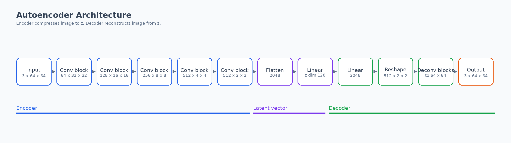

The encoder makes a small latent vector `z`. The decoder uses this vector to make the image again.

## 2. VAE Architecture

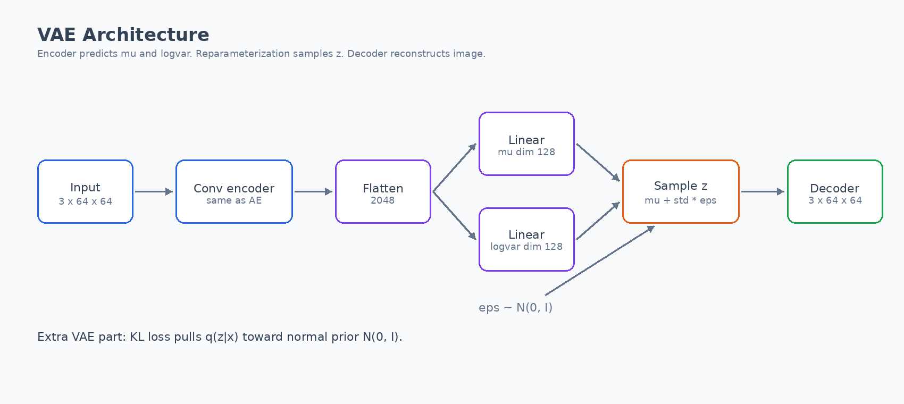

The VAE does not make only one `z`. It makes `mu` and `logvar`. Then it samples `z`. This helps the model learn a better latent space.

## 3. Hyperparameters

| Hyperparameter | Value |
|---|---:|
| Latent dimension | 128 |
| Base channels | 64 |
| Batch size | 512 |
| Optimizer | Adam |
| Learning rate | 1e-3 |
| Weight decay | 0 |
| Scheduler | CosineAnnealingLR |
| Minimum LR | 5e-5 |
| AE epochs | 40 |
| VAE epochs | 40 |
| beta-VAE epochs | 25 |
| beta values | 0.1, 1, 4, 10 |
| Early stopping patience | 7 |
| Device | NVIDIA A100 |
| Mixed precision | bfloat16 |

## 4. Loss Functions

For the Autoencoder:

```text
Loss = MSE(x, x_hat)
```

For the VAE:

```text
Loss = MSE(x, x_hat) + beta * KL
```

The KL term makes the latent space close to a normal prior `N(0, I)`.

## 5. Main Results

| Model | Validation reconstruction MSE per pixel | Validation KL |
|---|---:|---:|
| AE | 0.005033 | 0 |
| VAE, beta=1 | 0.010324 | 53.48 |

The AE has lower reconstruction error. This means it makes a better copy. The VAE has higher error, but it gives better random samples.

## 6. Part A: Autoencoder Results

### AE Loss Curves

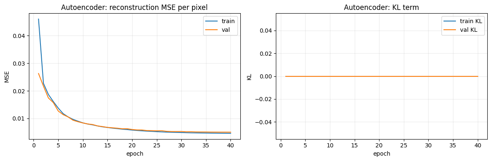

The AE loss goes down and becomes almost flat. This means the model trained well.

### AE Input and Reconstruction Pairs

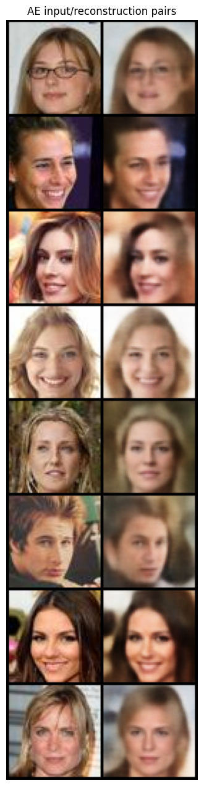

The AE keeps face shape, hair color, and pose. The copies are soft, but they are clear enough.

### AE Latent Interpolations

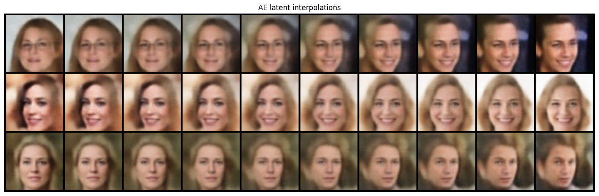

The AE interpolation is smooth. The face changes step by step from one image to another.

## 7. Part B: VAE Results

### VAE Loss Curves

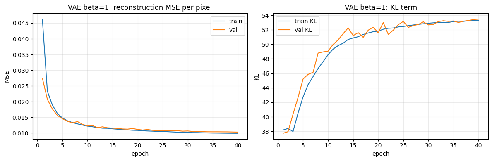

The VAE reconstruction loss goes down. The KL term goes up and then becomes more stable.

### VAE Input and Reconstruction Pairs

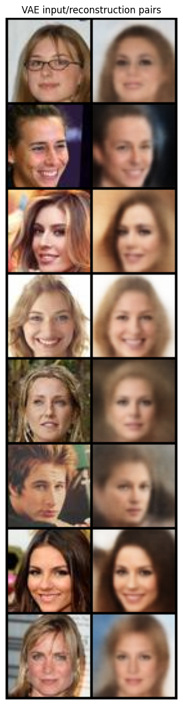

The VAE copies are more soft than AE copies. This is normal. The VAE must also learn a good latent distribution.

### VAE Latent Interpolations

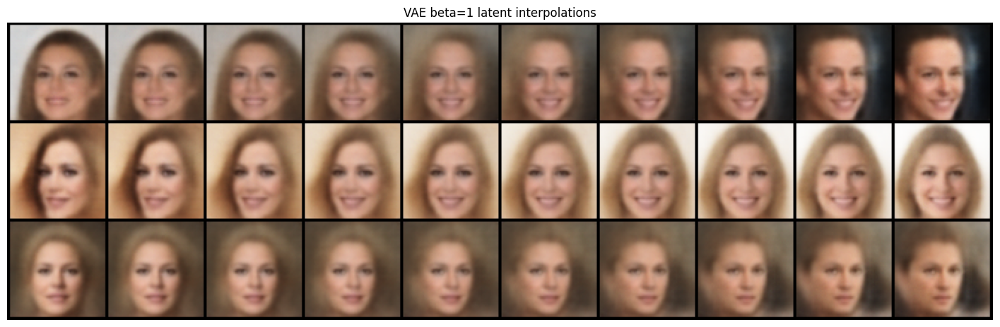

The VAE interpolation is smooth. The images change in a calm way.

## 8. AE vs VAE Comparison

### Latent Space PCA and t-SNE

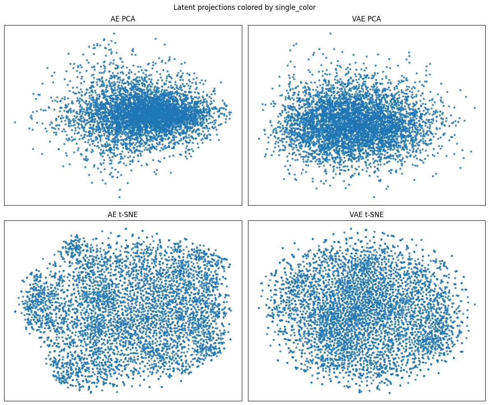

The plot has one color because there are no labels in this dataset. Still, we can see the shape of the latent spaces.

The AE latent space looks less regular. The VAE latent space looks more spread and more smooth. This is expected because the VAE uses the KL term.

### AE and VAE Interpolation Side by Side

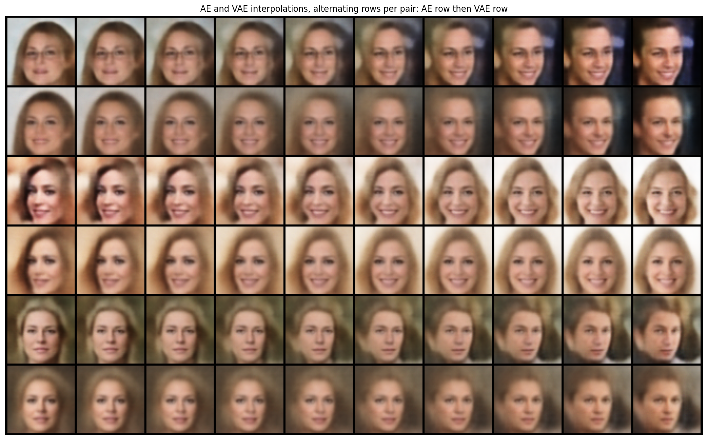

Both models make smooth changes. AE keeps more detail. VAE is more soft, but the path is stable.

### AE Random Samples

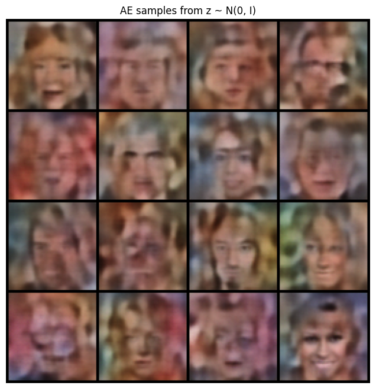

The AE samples from `z ~ N(0, I)` are weak. Some images look like faces, but many are not clean. This happens because the AE was not trained to use a normal prior.

### VAE Random Samples

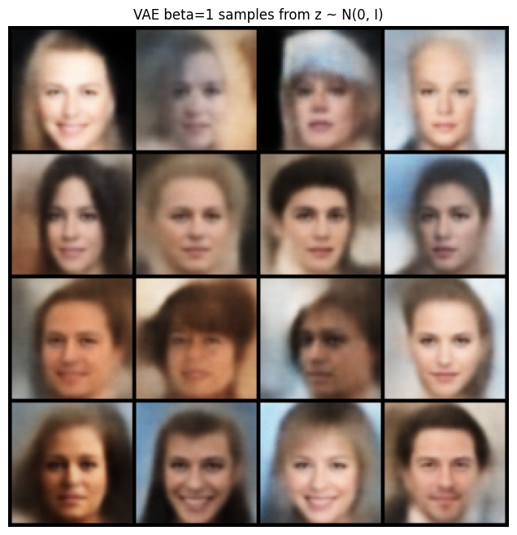

The VAE samples look more like real faces. This is the main benefit of the VAE. The KL term helps random normal `z` decode to a face.

## 9. beta-VAE Study

### Final Metrics

| beta | Best epoch | Validation reconstruction MSE per pixel | Validation KL |
|---:|---:|---:|---:|
| 0.1 | 25 | 0.007017 | 164.87 |
| 1.0 | 25 | 0.010942 | 51.14 |
| 4.0 | 24 | 0.016517 | 20.96 |
| 10.0 | 24 | 0.022708 | 10.50 |

### Reconstruction and KL vs beta

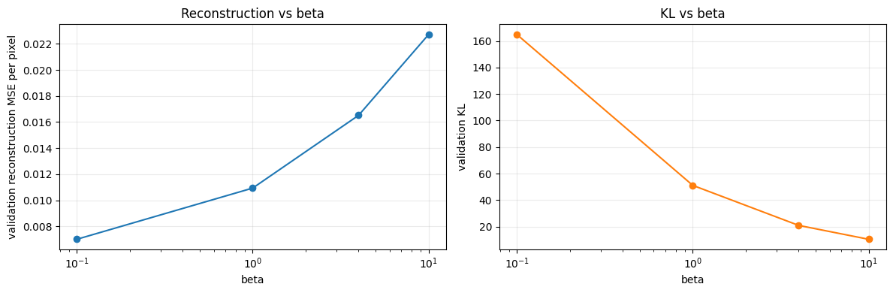

When beta gets bigger, KL gets smaller. But reconstruction gets worse. This shows the trade-off.

### beta = 0.1 Samples

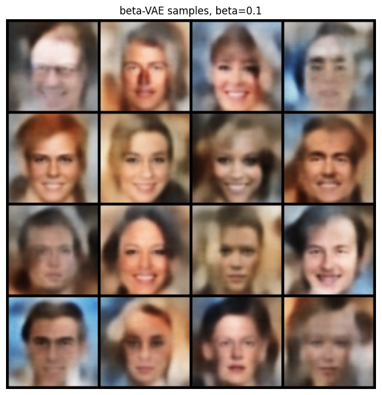

### beta = 0.1 Interpolations

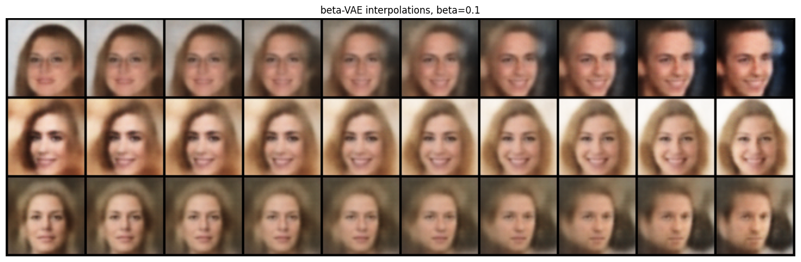

### beta = 1.0 Samples

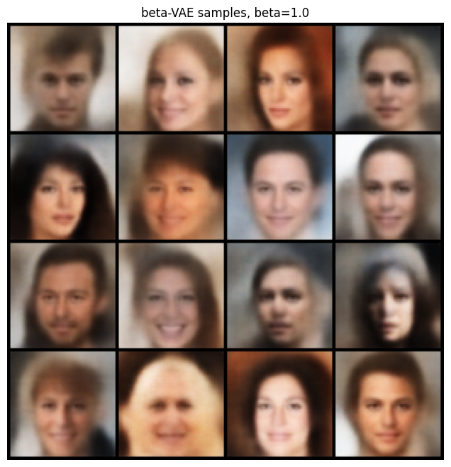

### beta = 1.0 Interpolations

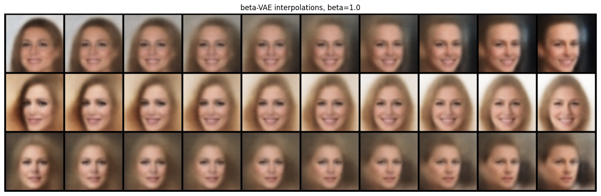

### beta = 4.0 Samples

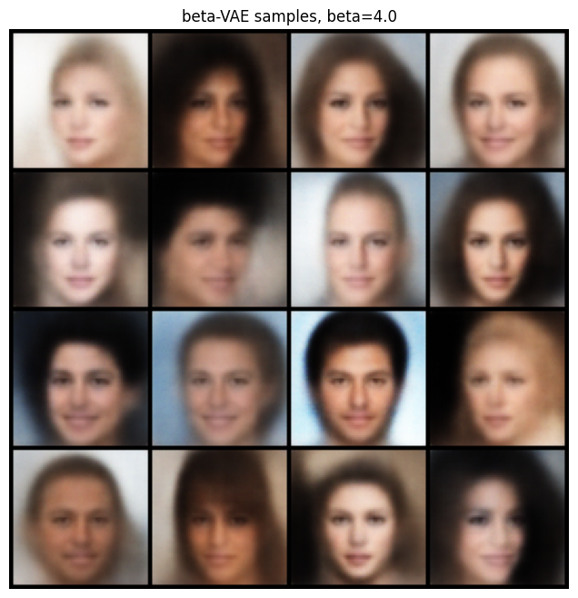

### beta = 4.0 Interpolations

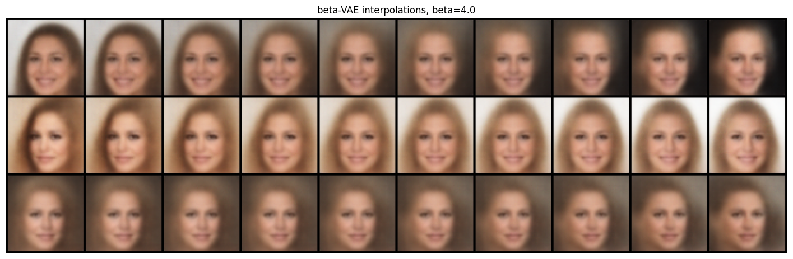

### beta = 10.0 Samples

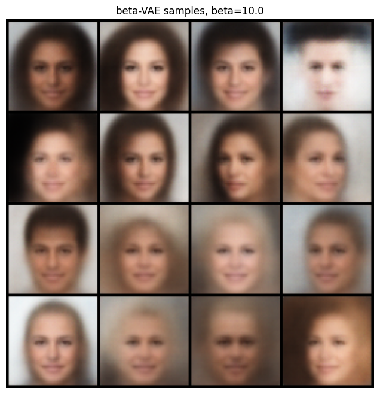

### beta = 10.0 Interpolations

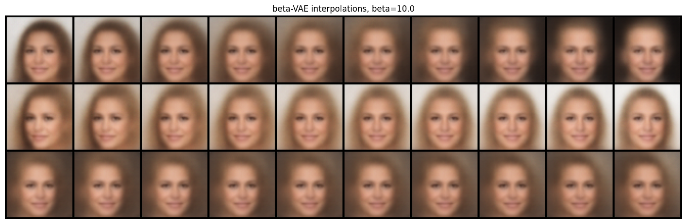

## 10. Analysis

The AE makes the best image copy. Its validation MSE is the lowest. But the AE does not learn a normal latent space. So random samples from `N(0, I)` are not very good.

The VAE makes softer copies. Its MSE is higher. But it can make better new faces from random latent vectors. This is because the KL term pushes the latent space close to `N(0, I)`.

The beta study shows a clear pattern. With small beta, the model cares more about image copy. So the reconstruction is better, but KL is high. With large beta, the model cares more about the prior. So KL is lower, but images are more blurry.

In this experiment, beta `1.0` is a good middle point. Beta `0.1` gives better copies, but weaker regularization. Beta `10.0` gives strong regularization, but worse copies.