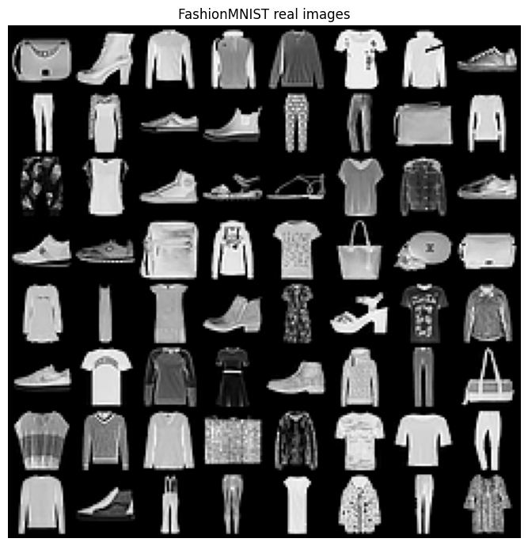
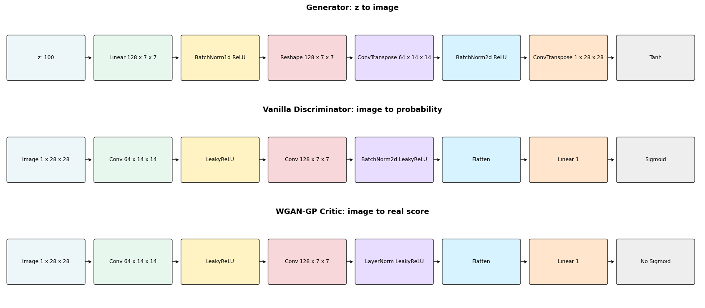
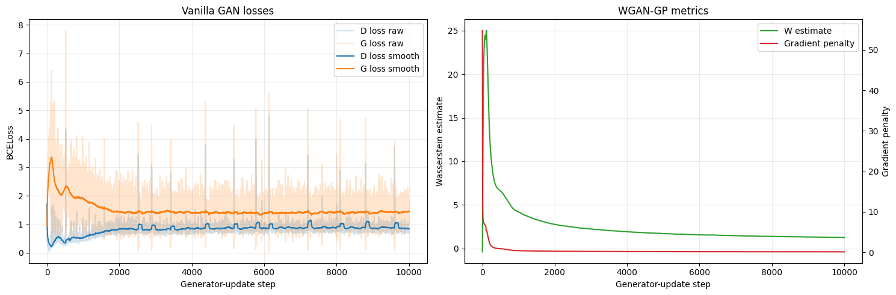
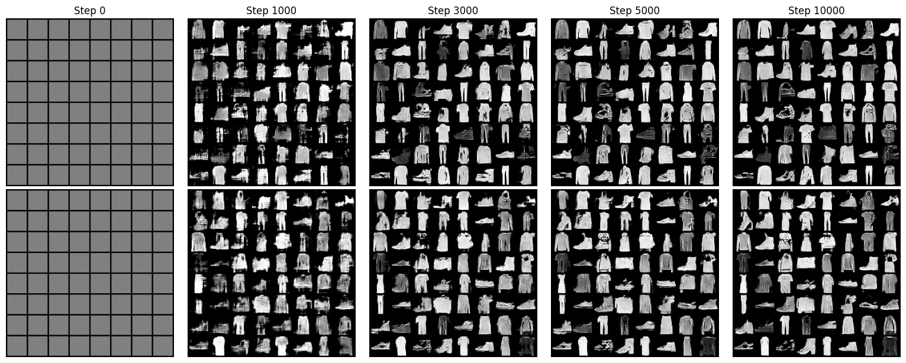
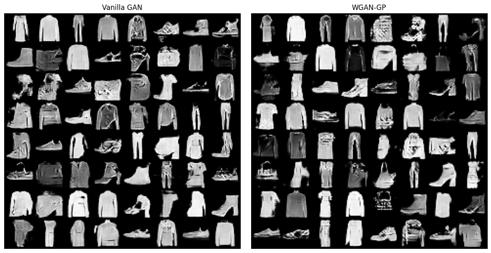

# Lab 2 Report

## 1. Dataset

This lab uses **FashionMNIST** for both models. The images are grayscale and have size `1 x 28 x 28`.

All images are normalized to `[-1, 1]`.




## 2. Architecture Diagrams



The generator is the same in both experiments. This is important because the comparison is about the training objective, not about model size.

The Vanilla GAN uses a discriminator with a Sigmoid output. The WGAN-GP uses a critic with no Sigmoid. The critic also uses LayerNorm instead of BatchNorm in the hidden convolution layer.

## 3. Hyperparameters

| Item | Value |
|---|---:|
| Dataset | FashionMNIST |
| Image size | 1 x 28 x 28 |
| Image normalization | [-1, 1] |
| Latent dimension | 100 |
| Batch size | 128 |
| Generator updates | 10,000 |
| Snapshot steps | 0, 1,000, 3,000, 5,000, 10,000 |
| Vanilla GAN optimizer | Adam |
| Vanilla GAN learning rate | 0.0002 |
| Vanilla GAN betas | 0.5, 0.999 |
| WGAN-GP optimizer | Adam |
| WGAN-GP learning rate | 0.0001 |
| WGAN-GP betas | 0.0, 0.9 |
| WGAN-GP critic updates | 5 per generator update |
| Gradient penalty lambda | 10 |
| Training dtype | float32 |

No mixed precision was used. The model was trained in float32.

## 4. Part A: Vanilla DCGAN

The generator maps `z ~ N(0, I)` from dimension 100 to an image.

The discriminator maps an image to a probability. Real images get label `1`. Fake images get label `0`.

The discriminator loss is:

```text
Loss_D = BCE(D(x_real), 1) + BCE(D(G(z).detach()), 0)
```

The generator uses the non-saturating objective:

```text
Loss_G = BCE(D(G(z)), 1)
```

At the end of training:

| Metric | Value |
|---|---:|
| Final D loss | 0.809276 |
| Final G loss | 1.214231 |

## 5. Part B: WGAN-GP

The WGAN-GP generator is unchanged from Part A.

The critic gives a real-valued score. It does not output a probability.

The critic loss is:

```text
Loss_C = E[C(G(z))] - E[C(x_real)] + Loss_GP
```

The generator loss is:

```text
Loss_G = -E[C(G(z))]
```

The gradient penalty is computed on interpolated images:

```text
x_hat = epsilon * x_real + (1 - epsilon) * G(z)
```

The code sets `x_hat.requires_grad_(True)` and uses `create_graph=True`. This is needed so the gradient penalty can update the critic weights.

At the end of training:

| Metric | Value |
|---|---:|
| Final G loss | 30.732437 |
| Final Wasserstein estimate | 1.288663 |
| Final gradient penalty | 0.119379 |


## 6. Figure 1: Loss Curves



The Vanilla GAN losses are noisy. This is normal for GAN training. The smoothed discriminator loss becomes stable near the end. The generator loss also becomes more stable after the early spike.

For WGAN-GP, the Wasserstein estimate is high at the start and then goes down. The gradient penalty is also high at the start, then quickly becomes small. This means the critic becomes more regular during training.

## 7. Figure 2: Sample Grid Evolution



The top row is the Vanilla GAN. The bottom row is WGAN-GP. Both rows use the same fixed `z_fixed` vectors. This makes the visual comparison fair.

At step 0, both models produce gray images because the generators are not trained yet. By step 1,000, both models already produce rough clothing shapes. By step 3,000 and 5,000, shoes, shirts, bags, trousers, and coats are clear. At step 10,000, both models produce recognizable FashionMNIST-like samples.

The Vanilla GAN samples look a little sharper in some cells, but some items have noisy texture. The WGAN-GP samples look slightly more stable across the row, with fewer very broken shapes.

## 8. Figure 3: Sampling from N(0, I)



After training, both generators can sample from a fresh normal latent batch.

The Vanilla GAN makes clear shirts, shoes, trousers, and bags. Some samples have rough edges or repeated texture.

The WGAN-GP also makes clear clothing items. Its samples look stable and diverse. Some images are still noisy, but the model usually keeps the object shape.

## 9. Comparison

The Vanilla GAN trained faster per generator update because it only uses one discriminator update. Its loss curves are harder to interpret because BCE loss does not directly show image quality.

The WGAN-GP is more expensive because it uses 5 critic updates per generator update. But its metrics are more meaningful. The gradient penalty shows if the critic is staying regular. In this run, the penalty became small after the first part of training.

Under the same generator-update budget, both models work well. The WGAN-GP objective gives a more stable training signal, while the Vanilla GAN gives good samples with less computation.
